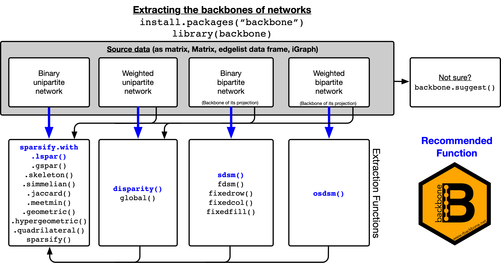

```{r, include = FALSE}
knitr::opts_chunk$set(collapse = TRUE, comment = "#>")
knitr::opts_knit$set(global.par = TRUE)
```

```{r, echo = FALSE}
set.seed(5)
par(mar = c(0, 0, 0, 0) + 0.1)
```

# Table of Contents {#toc}

[](https://www.rbackbone.net)

1. [Introduction](#introduction)
    a. [Welcome](#welcome)
    b. [Loading the package](#loading)
    c. [Package overview](#overview)
    d. [The narrative parameter](#narrative)
    e. [Supported data formats](#formats)
2. [Weighted bipartite projection networks](#projection)
    a. [Background](#proj-background)
    b. [Extracting the backbone](#proj-extract)
3. [Non-projection weighted networks](#weighted)
    a. [Background](#weight-background)
    b. [Extracting the backbone](#weight-extract)
4. [Unweighted networks](#unweighted)
    a. [Background](#unweight-background)
    b. [Extracting the backbone](#unweight-extract)
5. [Utility functions](#utility)
    a. [Estimate number of FDSM trials required](#trials)
    b. [Backbone extraction from backbone objects](#extraction)
    c. [Bipartite network genetation](#generation)
    d. [Matrix randomization](#randomization)
    e. [Bipartite Configuration Model (BiCM)](#bicm)

# Introduction {#introduction}

## Welcome {#welcome}
Thank you for your interest in the backbone package! This vignette illustrates how to use this package to extract the *backbone* of a network. A backbone is a sparse and unweighted subgraph of a network that contains only the most 'important' or 'significant' edges. A backbone can be useful when the original network is too dense, when edge weights are not needed, or when edge weights are difficult to interpret. While this vignette provides an overview and introduction, with some examples, for more details please see our latest manuscripts on backbone here:

* "Domagalski R., Neal Z.P., and Sagan B. (2021). Backbone: an R package for extracting the backbone of bipartite projections. *PLoS ONE 16(1)*: e0244363." [https://doi.org/10.1371/journal.pone.0244363](https://doi.org/10.1371/journal.pone.0244363)

* "Neal, Z. P., Domagalski, R, Sagan B. (2021). Comparing Alternatives to the Fixed Degree Sequence Model for Extracting the Backbone of Bipartite Projections. *Scientific Reports*. [https://arxiv.org/abs/2105.13396](https://arxiv.org/abs/2105.13396)

For additional resources on the backbone package, please see [https://www.rbackbone.net/](https://www.rbackbone.net).

If you have questions about the backbone package or would like a backbone hex sticker, please contact the maintainer Zachary Neal by email ([zpneal\@msu.edu](mailto:zpneal@msu.edu)) or via Twitter ([\@zpneal](https://twitter.com/zpneal)). Please report bugs in the backbone package at [https://github.com/domagal9/backbone/issues](https://github.com/domagal9/backbone/issues).

## Loading the package {#loading}
The backbone package can be loaded in the usual way:
```{r setup}
library(backbone)
```
Upon successful loading, a startup message will display that shows the version number, citation, ways to get help, and ways to contact us.

## Package overview {#overview}
The primary use of the backbone package is backbone extraction, that is, identifying and preserving only the most important edges in a network. Different types of networks require different backbone extraction methods, however the basic workflow using the backbone package is the same for all methods:

* You begin with some network data `dat`, which may take any of the following forms: an adjacency matrix (as a matrix, Matrix, or Sparse Matrix object), an edge list (as a 2- or 3-column matrix or data frame), a statnet object, or an igraph object.

* You run an applicable backbone function on these data (e.g., `sdsm(dat)`), which yields an unweighted network of the same class as `dat`.

The figure illustrates which functions are applicable for which types of network data, and highlights in blue the analytic workflow and function that is recommended for each type.



If you are unsure about your type of network data or which backbone function to use, you can run `suggest.backbone(dat)`. This helper function will examine the data and make a suggestion. If you also specify a significance level or sparsification parameter `s`, then the function will extract the backbone using the suggested approach and will display text describing what it did. In all cases, `s` can range from 0 to 1, with smaller values yielding sparser backbones. For example:
```{r}
dat <- matrix(runif(100),10,10)  #Some data

backbone.suggest(dat)  #What should I do?

backbone <- backbone.suggest(dat, s = 0.05)  #Or, just do it
```

The sections below describe and illustrate the backbone functions applicable to different types of networks, including [weighted bipartite projections](#projection), [non-projection weighted networks](#weighted), and [unweighted networks](#unweighted). Additionally, the package includes several [utility functions](#utility) that are used by the backbone methods, but may also have independent applications.

## The `narrative` parameter {#narrative}
Most functions in the backbone package include a `narrative` parameter. When `narrative = TRUE`, narrative text describing the backbone extraction will be displayed with the relevant citations. This text is suitable for use in manuscripts, and ensures complete and consistent reporting of the backbone extraction. You can see an example of this type output in the `backbone.suggest()` example above, as well as in some of the examples shown below.

## Supported data formats {#formats}
The functions in the backbone package support many different data formats that can be used to represent a network or graph in R:

* **matrix** - A bipartite network can be represented as an incidence matrix, and a unipartite matrix can be represented as an adjacency matrix. An incidence/adjacency matrix can be supplied to a backbone extraction function as a *matrix* object, a *sparse Matrix* object from the Matrix package, or a *dataframe* object.

* **edgelist** - A network can be represented as an edgelist, which can be supplied to a backbone extraction function as a *matrix* object, a *sparse Matrix* object from the Matrix package, or a *dataframe* object. These objects should have two or three columns; the first two columns contain the IDs of the sending and receiving nodes, respectively, while the third column (optionally) contains the edge weights.

* **igraph** or **network** - A network can be supplied to a backbone extraction function as an *igraph* object from the igraph package, or as a *network* object from the statnet package.

[back to Table of Contents](#toc)

# Weighted bipartite projection networks {#projection}
## Background [@neal2014backbone] {#proj-background}
A bipartite network contains two types of nodes, which we call *agents* and *artifacts*, and edges that exist only between nodes of different types (i.e., an edge may connect an agent to an artifact, but never an agent to another agent). A bipartite network can be represented by a matrix **B**, where B~ik~ = 1 if agent *i* is connected to artifact *k*, and otherwise is 0 (e.g., author *i* wrote paper *k*). The row sums of **B** indicate agent degrees (e.g., the number of papers written by author *i*), while the column sums of **B** indicate artifact degrees (e.g., the number of authors on paper *k*).

A bipartite projection is a network of *agents* that are connected by the fact that they share *artifacts* in common. A bipartite projection can be represented by a square symmetric matrix **P**, which is formed as **P** = **B** * **B**', where **B**' is the transpose of **B**. In **P**, P~ij~ indicates the number of artifacts *k* that are shared by agents *i* and *j*, and can be viewed as the weight of the edge connecting them in the network (e.g., the number of papers co-authored by authors *i* and *j*).

The goal of backbone extraction from bipartite projections is to identify edges in **P** whose weights are statistically significantly strong (or weak, for signed backbones), and thus should be preserved in the backbone. All methods implemented in the backbone package use the same approach for testing the statistical significance of edges:

1. Compute P~ij~
2. Generate a bipartite network **B*** that preserves features of **B**, but otherwise is random. All methods preserve **B**'s number of rows and columns. `fixedfill()` preserves the total number of 1s in **B**, `fixedrow()` preserved the row sums of **B**, and `fixedcol()` preserved the column sums of **B**. Finally, `fdsm()` and `sdsm()` preserve both the row and column sums of **B**; the former preserves them exactly, while the latter preserves them on average.
3. Compute **P*** = **B*** * **B***'
4. Compute and save P*~ij~
5. Repeat steps 2-4 *N* times
6. Compute the positive p-value associated with edge P~ij~ as: (number of times P\*~ij~ > P~ij~) / *N*

This approach relies on Monte Carlo simulation, and is used by `fdsm()`. However, for the other bipartite backbone null models, the distribution of P\*~ij~ is known and does not require simulation [@neal2021comparing], which makes them faster. Additionally, this process preserves only edges that are statistically significantly *stronger* than expected under the chosen null model, thus yielding a binary backbone. However, it is also possible to preserve edges that are statistically significantly *weaker*, and thus to obtain a signed backbone.

## Extracting the backbone [@domagalski2021backbone] {#proj-extract}
Because all bipartite backbone functions work similarly, here we will use the stochastic degree sequence model and `sdsm()` function as an example, applying it to simulated data.

We begin by creating a simulated bipartite network, stored in a matrix `B`. This network contains 30 agents (rows) and 75 artifacts (columns). The agents are connected to the artifacts in a way that we might expect if the agents form three cohesive communities. For example, this could represent authors from three distinct disciplines, and the papers they have written. In practice, `B` can take the form of a matrix object (as in this example), but could take other forms, such as a bipartite network stored in a `statnet` or `igraph` class object.
```{r}
B <- rbind(cbind(matrix(rbinom(250,1,.8),10),
                 matrix(rbinom(250,1,.2),10),
                 matrix(rbinom(250,1,.2),10)),
           cbind(matrix(rbinom(250,1,.2),10),
                 matrix(rbinom(250,1,.8),10),
                 matrix(rbinom(250,1,.2),10)),
           cbind(matrix(rbinom(250,1,.2),10),
                 matrix(rbinom(250,1,.2),10),
                 matrix(rbinom(250,1,.8),10)))
```

Looking at a portion of the bipartite network, we can see that author 1 was an author on papers 2-5, but not paper 1:
```{r}
B[1:5,1:5]
```

Looking at the row and column sums, we can also see that each author wrote about 30 papers, and each paper has about 10 authors, but there is some variation:
```{r}
rowSums(B)
colSums(B)
```

We can construct an ordinary weighted bipartite projection, then plot it using `igraph`, but the result is a dense and uninformative network with no obvious communities:
```{r}
P <- B%*%t(B)
plot(igraph::graph_from_adjacency_matrix(P, mode = "undirected", diag = FALSE, weighted = TRUE), vertex.label = NA)
```

Instead, we can extract the backbone of the weighted bipartite projection using the stochastic degree sequence model. By choosing the SDSM, we are comparing the observed edge weights to those that would be observed under a null model where each of the authors wrote approximately the same number of papers as in `B`, and each of the papers have approximately the same number of authors as in `B`, but which authors wrote which papers is random:
```{r}
bb <- sdsm(B, alpha = 0.075, narrative = TRUE, class = "igraph")
```

Notice that this function is performed on the original bipartite network `B`, not on the bipartite projection `P`. We use `alpha = 0.075` to indicate that edges should be preserved at the 0.075 level of statistical significance; we use an unusually large value in this example only because it is a small toy network. We use `narrative = TRUE` to request that suggested manuscript text and citations be displayed. Finally, we use `class = "igraph"` to request that the resulting backbone be returned as an `igraph` class object, to facilitate further analysis. When we plot the backbone, the three communities are now clearly visible:
```{r}
plot(bb, vertex.label = NA)
```

[back to Table of Contents](#toc)

# Non-projection weighted networks {#weighted}
## Background {#weight-background}
A weighted unipartite network contains one type of node, and pairs of nodes are connected by edges that have weights. These weights usually indicate the intensity of the relationship between them (e.g., strength, intensity, etc.). A weighted unipartite network can be represented by a matrix **W**, where W~ij~ indicates the weight of the edge between node *i* and node *j*. Weighted networks can be undirected (i.e., W~ij~ = W~ji~) or directed (i.e., W~ij~ != W~ji~).

The goal of backbone extraction from a weighted network is to identify edges in **W** whose weights are statistically significantly strong (or weak, for signed backbones), and thus should be preserved in the backbone. One simple possibility is to apply a global threshold *T*, such that all edges with weights stronger than *T* are preserved, however this approach tends to systematically overlook nodes with low degree. Alternative approaches, such as the disparity filter [@serrano2009extracting], involve comparing edge weights to their expected values under a null model that considers each node's local neighborhood.

## Extracting the backbone {#weight-extract}
To illustrate extracting the backbone from a weighted network, we begin by creating a simulated weighted network, stored in a matrix `W`. This network has strongly heterogeneous edge weights; some are quite weak (10) while others are quite strong (100), which gives the network a multi-scalar character. This network might represent the number of passengers flying between each of 10 airports, where there are two hub airports (one large, one small) that each serve their local areas.
```{r}
W <- matrix(c(0,10,10,10,10,75,0,0,0,0,
              10,0,1,1,1,0,0,0,0,0,
              10,1,0,1,1,0,0,0,0,0,
              10,1,1,0,1,0,0,0,0,0,
              10,1,1,1,0,0,0,0,0,0,
              75,0,0,0,0,0,100,100,100,100,
              0,0,0,0,0,100,0,10,10,10,
              0,0,0,0,0,100,10,0,10,10,
              0,0,0,0,0,100,10,10,0,10,
              0,0,0,0,0,100,10,10,10,0),10)
```

We could simply examine this network as a weighted network, however this yields a cluttered visualization, and many network analytic techniques (e.g., ERGM, SOAM) are not possible with weighted networks:
```{r}
weighted <- igraph::graph_from_adjacency_matrix(W, mode = "undirected", weighted = TRUE, diag = FALSE)
plot(weighted, edge.width = sqrt(igraph::E(weighted)$weight), vertex.label = NA)
```

We could extract a backbone by applying a global threshold using the `global()` function. One possibility is to extract a backbone that preserves all edges with weights greater than 0. However, this yields a network that is very dense because all edges are preserved:
```{r}
bb <- global(W, upper = 0, class = "igraph")
plot(bb, vertex.label = NA)
```

Instead, we could choose the threshold value based on the edge weights. For example, we could extract a backbone by using the average edge weight as the global threshold, thus obtaining a backbone that preserves stronger-than-average edges. However, this yields a network that is focused only on high-degree nodes (i.e., the large hub airport), while ignoring the low-degree nodes (i.e., the smaller hub airport):
```{r}
bb <- global(W, upper = function(x)mean(x), class = "igraph")
plot(bb, vertex.label = NA)
```

A better option is to extract the backbone using a statistical null model, such as the disparity filter (currently, the only available model). Now we can clearly see the hub-and-spoke structure of the transportation system:
```{r}
bb <- disparity(W, alpha = 0.05, narrative = TRUE, class = "igraph")
plot(bb, vertex.label = NA)
```

[back to Table of Contents](#toc)

# Unweighted networks {#unweighted}
## Background {#unweight-background}
An unweighted unipartite network contains one type of node, and pairs of nodes are either connected or not. An unweighted unipartite network can be represented by a matrix **U** where U~ij~=1 if nodes *i* and *j* are connected, and otherwise is 0. Unweighted networks can be undirected (i.e., W~ij~ = W~ji~) or directed (i.e., W~ij~ != W~ji~).

The goal of backbone extraction from an unweighted network is to identify edges in **U** that are important to the network's structure, and thus should be preserved in the backbone. Because the network is already unweighted, and the goal is simply to reduce the number of edges, this process is sometimes also called *sparsification*. The challenge is that, unlike [bipartite projections](#projection) and [weighted networks](#weighted), the edges in unweighted networks do not have weights that can be used to evaluate their importance.

To overcome this challenge, backbone models designed for unweighted networks first assign each edge a score that is intended to capture its importance. Many different possible edge scoring metrics have been proposed. For example, the *jaccard* coefficient assigns an edge a score that captures the amount of overlap in its two endpoints' neighborhoods. In the context of a social network, the jaccard coefficient of edge U~ij~ would indicate the extent to which *i*'s friends are also *j*'s friends. Similarly, the *triangle count* has also been proposed as an edge scoring metric, and counts the number of triangles that are completed by an edge. This metric draws on sociological theory (e.g., Simmel, Granovetter) to view triangle-completing edges as important because they form cohesive triads.

Although many sparsification models have been proposed, each one is defined by four characteristics:
* What metric is used for the edge *score*?
* How is the edge score *normalized*?
* How are edges *filtered* based on the (normalized) edge score?
* Are edges in the union of minimum spanning trees (*UMST*) preserved to ensure connectivity?

## Extracting the backbone {#unweight-extract}
The backbone of an unweighted network can be extracted using the `sparsify()` function, which includes parameters that answer each of the four questions that define a sparsification model (`escore`, `normalize`, `filter`, and `umst`), as well as a sparsification parameter `s` that controls the amount of sparsification.

Specific combinations of these parameters correspond to named sparsification models that have been proposed in the literature. For example, the *L-spar* sparsification model [@satuluri2011local] can be obtained using `sparsify(escore = "jaccard", normalize = "rank", filter = "degree", umst = FALSE)`. For this reason, the backbone package includes several wrappers for the `sparsify()` function that return specific named sparsification models. For example, the `sparsify.with.lspar()` function is a wrapper that uses the above `sparsify()` options.

Different sparsification models are designed to perserve different structural features believed to be embedded in dense networks. To illustrate extracting the backbone from an unweighted network believed to contain communities, we begin by creating a dense unweighted network `U1`. This network contains 60 nodes, but is so dense that the presence of communities is obscured:
```{r}
U.with.communities <- igraph::sbm.game(60, matrix(c(.75,.25,.25,.25,.75,.25,.25,.25,.75),3,3), c(20,20,20))
plot(U.with.communities, vertex.label = NA)
```

However, the backbone of this dense network can be extracted using the L-spar sparsification model, which clearly reveals a three-community structure:
```{r}
bb <- sparsify.with.lspar(U.with.communities, s = 0.6, narrative = TRUE)
plot(bb, vertex.label = NA)
```

To illustrate extracting the backbone from an unweighted network believed to contain highly central hub nodes, we begin by creating another dense unweighted network `U2`. This network contains 60 nodes, but is so dense that the presence of hubs is obscured:
```{r}
U.with.hubs <- igraph::as.undirected(igraph::sample_pa(60, m = 3), mode = "collapse")
plot(U.with.hubs, vertex.size = igraph::degree(bb), vertex.label = NA) #A hairball
```

However, the backbone of this dense network can be extracted using the local degree sparsification model [@hamann2016structure], which clearly reveals the hub-and-spoke structure of the network:
```{r}
bb <- sparsify.with.localdegree(U.with.hubs, s = 0.3, narrative = TRUE)
plot(bb, vertex.size = igraph::degree(bb), vertex.label = NA)
```

[back to Table of Contents](#toc)

# Utility functions {#utility}
## Estimate number of FDSM trials required [@neal2021comparing] {#trials}
The fixed degree sequence model estimates edgewise p-values via Monte Carlo simulation. One challenge to using the FDSM is deciding how many Monte Carlo trials are necessary to obtain stable p-value estimated, but the `fdsm.trials()` function can provide some guidance. The estimates rely on formulas used for estimating sample size requirements when estimating a proportion [@fleiss2013statistical], and should be treated as a rough guide. 

Given a bipartite network `B`, `fdsm.trial` will estimate the number of Monte Carlo trials necessary to obtain stable p-value estimates that can be used to extract the backbone from a projection of `B`. The function uses reasonable defaults for the alpha significance level and Type-I and Type-II error. In this example, we specify that we do not intend to perform a familywise error rate correction (`fwer = FALSE`),  and that the riskiest p-value we are concerned about is 75% of our alpha significance level (`riskyp = .75`). Under these assumptions, we should perform at least 2962 Monte Carlo trials when using FDSM (i.e. `fdsm(B, trials = 2962)`).
```{r}
B <- matrix(rbinom(100*1000,1,0.5),100,1000)
fdsm.trials(B, riskyp = .75, fwer = FALSE)
```

Extracting a backbone requires evaluating the statistical significance of every edge in the network, which can lead to Type-I error inflation and false positives. Therefore, it is often desirable to perform a familywise error rate correction (this is available using the `fwer` parameter in most backbone extraction functions). However, doing so requires more precise p-values, which can require an impractically large number of Monte Carlo trials. For example, under the same assumptions as above, if we intend to perform a familywise error rate correction (`fwer = TRUE`), we would need to perform at least 15,318,477 Monte Carlo trials when using FDSM, which likely makes an FDSM backbone computationally infeasible.
```{r}
fdsm.trials(B, riskyp = .75, fwer = TRUE)
```

## Backbone extraction from ensemble backbone objects {#extraction}
If the `alpha` parameter is specified when using any of the bipartite projection (e.g., `sdsm()`) or weighted (e.g., `disparity()`) backbone functions, they return the backbone network. If the `alpha` parameter is not specified, these functions instead return an S3 backbone-class object that contains p-values for each edge. The `backbone.extract()` function can be applied to this object to extract backbones at different alpha significance levels.

This can be particularly useful in the case of backbones extracted using models that are computationally intensive, such as the fixed degree sequence model (FDSM). values To illustrate, we use a simulated bipartite network whose backbone *should* contain evidence of agents clustered in three communities, and we use `fdsm()` *without* the `alpha` parameter to compute edgewise p-values and store them in a backbone object:
```{r}
B <- rbind(cbind(matrix(rbinom(250,1,.8),10),
                 matrix(rbinom(250,1,.2),10),
                 matrix(rbinom(250,1,.2),10)),
           cbind(matrix(rbinom(250,1,.2),10),
                 matrix(rbinom(250,1,.8),10),
                 matrix(rbinom(250,1,.2),10)),
           cbind(matrix(rbinom(250,1,.2),10),
                 matrix(rbinom(250,1,.2),10),
                 matrix(rbinom(250,1,.8),10)))
bb.object <- fdsm(B)  #Backbone object containing edgewise p-values
```

We can extract a backbone from this backbone object using a very liberal alpha significance level, which results in many edges being retained:
```{r}
bb1 <- backbone.extract(bb.object, alpha = 0.5, class = "igraph")  #Backbone extracted at alpha = 0.05
plot(bb1)
```

Then we can extract another backbone, using a more conservative alpha significance level that retains fewer edges, from the same backbone object without needing to recompute the p-values:
```{r}
bb2 <- backbone.extract(bb.object, alpha = 0.05, class = "igraph")  #Backbone extracted at alpha = 0.05
plot(bb2)
```

## Bipartite generation {#generation}
The backbone package includes several functions designed to generate random bipartite networks. The simplest, `bipartite.from.probability()`, generates a bipartite network containing a given number of agents/rows (`R`) and a given number of artifacts/columns (`C`), where agents and connected to artifacts with a given probability (`P`), and no agent or artifact is either an isolate or maximally connected:
```{r}
B <- bipartite.from.probability(R = 5, C = 10, P = .5)
B
```

The `bipartite.from.sequence()` function generates a random bipartite network with given row (`R`) and column (`C`) degree sequences:
```{r}
B <- bipartite.from.sequence(R = c(1,1,2), C = c(1,1,2))
B
```

The `bipartite.from.distribution()` function generates a random bipartite network with a given number of rows (`R`), columns (`C`), and probability of an edge (`P`), where the row degrees (`rowdist`) and column degrees (`coldist`) approximately follow given beta distributions. For example, a beta distribution with an alpha paramater of 1 and beta parameter of 10 is right-tailed, so `rowdist = c(1,10)` and `coldist = c(1,10)` will yield a bipartite network with right-tailed agent and artifact degree distributions:
```{r}
par(mfrow=c(1,2), pty="s", mar=c(1,1,1,1))
B <- bipartite.from.distribution(R = 100, C = 100, P = 0.1, rowdist = c(1,10), coldist = c(1,10))
hist(rowSums(B), main = "Agent Deg.", xlab = "", yaxt='n')
hist(colSums(B), main = "Artifact Deg.", xlab = "", yaxt='n')
```

Finally, the `bipartite.add.blocks()` function attempts to add a block structure to a random bipartite network, such that it contains `blocks` blocks and `density` proportion of edges are within-block, while preserving the degree distributions. For example, given a random bipartite network `B`, we can shuffle the edges such that 75% connect a type-A agent to a type-A artifact (i.e., the A block), or a type-B agent to a type-B artifact (i.e. the B-block):
```{r}
B <- bipartite.from.probability(R = 10, C = 10, P = .4)
B <- bipartite.add.blocks(B, blocks = 2, density = .75)
B  #Contains blocks
```

## Matrix randomization {#randomization}
Extracting a backbone from a bipartite projection using the fixed degree sequence model and `fdsm()` function requires randomly sampling matrices from the space of all binary matrices with given row and column sums. The fastball algorithm is a faster version of the curveball algorithm [@strona2014fast], that has been implemented in C++ for efficiency. Given a matrix, `fastball()` returns a new matrix randomly sampled from the space of all binary matrices with the same row and column sums:
```{r}
mat <- rbind(c(1,0,0), c(0,0,1), c(0,1,1))
mat
fastball(mat)
```

## Bipartite Configuration Model (BiCM) {#bicm}
Extracting a backbone from a bipartite projection using the stochastic degree sequence model and `sdsm()` function requires determining the probability that B~ij~ = 1 in the space of all matrices with given row and column sums. For example, if the row sums of **B** are [1,1,2] and the column sums of **B** are [1,1,2], then in the space of all matrices with these row and column sums, the probability that B~ij~ = 1 is:

||||
|:--:|:--:|:--:|
|.2|.2|.6|
|.2|.2|.6|
|.6|.6|.8|

These probabilities are usually unknown and must be estimated. The fastest and most accurate way to estimate them [@neal2021comparing] is using the Bipartite Configuration Model [@saracco2015]. Given a matrix `mat` with specific row and column sums, `bicm()` estimates these probabilities:
```{r}
mat <- rbind(c(1,0,0), c(0,0,1), c(0,1,1))
bicm(mat)
```

[back to Table of Contents](#toc)

# References
